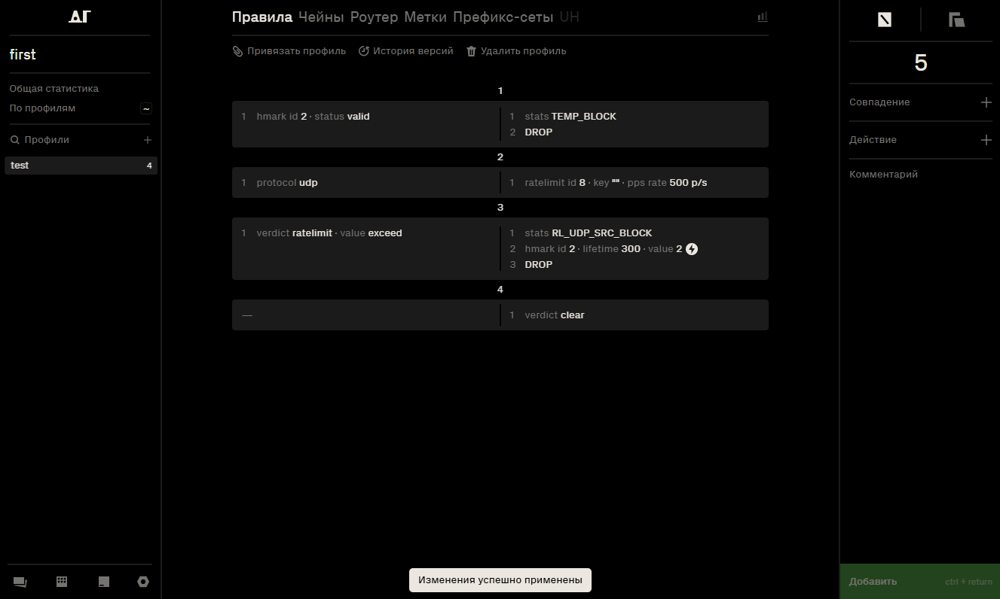

# ПАНКИ ХОЙ

* `mkdocs new [dir-name]` - Create a new project.
* `mkdocs serve` - Start the live-reloading docs server.
* `mkdocs build` - Build the documentation site.
* `mkdocs -h` - Print help message and exit.

## Project layout

    mkdocs.yml    # The configuration file.
    docs/
        index.md  # The documentation homepage.
        ...       # Other markdown pages, images and other files.

**Правила** – алгоритм (инструкция) для обработки трафика.  

## Создание и редактирование правил  

Правила могут быть заданы одним из двух способов: с использованием пресета или вручную.

### Создание правила через пресет

1. Перейти в необходимый профиль.  
2. Выбрать опцию **Создать через пресет**.  
3. В правом нижнем углу отобразятся доступные контрмеры:  

	-  Контрмеры отображаются фиолетовым цветом, если подключена база вредоносных сигнатур.  
	-  Контрмеры отображаются белым цветом, если они были созданы вручную в разделе **Пресеты**.  

4. Выбрать необходимую контрмеру и перетянуть в поле **Правила**.  
5. Для применения изменений необходимо нажать желтую кнопку **Применить**  

### Создание правила вручную

1. Перейти в необходимый профиль.  
2. Выбрать опцию **Вручную**.  

В DosGate правила создаются путем комбинирования совпадений  и действий. Совпадения определяют условия, при которых правило срабатывает. Действия применяются к трафику, если условия совпадений выполнены. Такой процесс позволяет гибко настраивать фильтрацию и управление трафиком. 

### Примеры 

**Назначение правила:** Ограничения доступа на основе географического происхождения IP-адреса. Весь трафик, не относящийся к России, будет отброшен.  

1. В интерфейсе профиля нажать кнопку **Вручную**. Это откроет форму для настройки совпадений.

2. В поле **Совпадение** выбрать параметр **geoip** →  **country** → **RU**.

3. Активировать радиокнопку **NOT**, чтобы применить логическое отрицание. Условие будет выполняться для всех IP-адресов, не принадлежащих РФ. 

4. В поле **Сверяем** установить **src**, правило будет охватывать весь трафик, *источник* которого находится за пределами РФ. Нажать кнопку **Добавить**.

5. В поле **Действие** выбрать **STATS** — это позволяет записывать все срабатывания правила в отдельный счётчик. Ввести имя счётчика: *GEO_NOT_RU*, чтобы в дальнейшем можно было анализировать объём и частоту трафика, не относящегося к России. Нажать кнопку **Добавить**.

6.  В поле **Действие** выберать **DROP** - это действие приведёт к немедленному отбрасыванию всех пакетов, соответствующих условию (т.е. всех, кто не из РФ). Пакеты будут сброшены без уведомления отправителя и без дальнейшей обработки.

7. При необходимости добавить комментарий к правилу. Это может быть пояснение или примечание для администратора.

8. Нажать зелёную кнопку **Добавить**, чтобы сохранить правило в список.

9. После добавления необходимо нажать жёлтую кнопку **Применить** в левой части интерфейса. Только после этого правило будет активно и начнёт применяться к обрабатываемому трафику.

**Назначение правила:** Ограничение частоты UDP-трафика с последующей временной блокировкой IP-адреса-источника при превышении лимита. Правило также регистрирует статистику по всем срабатываниям.

1. В интерфейсе профиля нажать кнопку **Вручную**. Это откроет форму для настройки совпадений.

2. В поле **Совпадение** выбрать параметр **protocol** → **udp**. Нажать зелёную кнопку **Добавить**  Это ограничит обработку правил только UDP-трафиком. 

3. В поле **Действие** выбрать **ratelimit**, указав параметры:
	- **id** → **8**
	- **pps → rate** → **500**  

	Нажать зелёную кнопку **Добавить**. Это ограничение установит максимум 500 пакетов в секунду от одного источника. В правом нижнем углу нажать зелёную кнопку **Добавить** для добавления первого правила.  

4. Добавить второе правило. В поле **Совпадение** выбрать **verdict**, установить:
	- **type** → **ratelimit**
	- **value** → **exceed**  

	Нажать зелёную кнопку **Добавить**.Это условие будет выполнено, если лимит, указанный в предыдущем шаге, превышен.

5. В поле **Действие** поочередно выбрать:
	- **STATS** – имя счётчика *RL_UDP_SRC_BLOCK*. Это позволит учитывать случаи превышения лимита. Нажать кнопку **Добавить**.
	- **HMARK**, указав:
		- **id** → **2**
		- **value** → **2**
		- **lifetime** → **300**  
	Нажать кнопку **Добавить**. Действие установит метку на IP-адрес на 300 секунд.
	- **DROP** – для немедленного отбрасывания пакета.  

	В правом нижнем углу нажать зелёную кнопку **Добавить** для добавления второго правила.  

6. Добавить третье правило. В поле **Действие** выбрать:
	- **verdict** → **clear**.  

	Нажать кнопку **Добавить**. Сбрасывает **verdict** правила, если ни одно из предыдущих условий не выполнено.

	В правом нижнем углу нажать зелёную кнопку **Добавить** для добавления третьего правила.  

7. Добавить четвертое правило. В поле **Совпадение** добавить параметр **HMARK**, указав:
   - **id** → **2**
   - **status** →  **valid**  
   Нажать кнопку **Добавить**. Это условие проверяет, что у пакета уже установлена действительная хеш-метка.

8. В поле **Действие** выбрать **STATS** и ввести имя счётчика: *TEMP_BLOCK*. 
   Нажать кнопку **Добавить**. Это позволит отслеживать количество срабатываний правила.  

9. Добавить ещё одно действие: **DROP**.  
Все пакеты с валидной меткой **2** будут отброшены.  
Нажать зелёную кнопку **Добавить**, чтобы сохранить правило в список.

10. Необходимо переместить четвёртое правило в начало списка правил (сделать его первым).
Это обеспечивает приоритетную фильтрацию пакетов, уже помеченных **HMARK id 2**, без повторной проверки всех условий, заданных ниже. Такое расположение позволяет сразу отбрасывать трафик, ранее идентифицированный как превышающий лимит, минимизируя нагрузку на последующую обработку.

12. Нажать жёлтую кнопку **Применить** в левой части интерфейса. Только после этого правила начнут применяться к трафику.

## Совпадения

В системе Dosgate каждая проверка совпадения содержит один или несколько аргументов, настраиваемых пользователем. Для всех совпадений предусмотрена возможность включения флага **NOT**, реализованного в виде переключателя. **NOT** — логическая операция отрицания, при активации которой условие совпадения инвертируется: правило сработает для всех значений, кроме указанного.

###  	&#128309; *dport* - Порт получателя  

| Параметр | Описание                                                                 |
|----------|--------------------------------------------------------------------------|
| **port** | Номер порта, для которого применяется правило (диапазон от 0 до 65535) |

### *dst* - IP получателя  

| Параметр    | Описание                                                                 |
|-------------|--------------------------------------------------------------------------|
| **IP-маска** | Префикс, для которого применяется правило (Если маска подсети не указана, по умолчанию будет применена маска /32) |

### *hmark* - Метка для IP-отправителя  

| Параметр   | Варианты  | Описание                                                                 |
|------------|-----------|--------------------------------------------------------------------------|
| **id**     |           | Идентификатор метки (диапазон от 1 до 255)                             |
| **status** |           | Состояние метки. Возможные значения:                                    |
|            | *expired* | Метка существует, но срок действия истёк                               |
|            | *valid*   | Метка активна, срок действия не истёк                                  |
| **age_op** |           | Оператор сравнения для времени жизни метки:                             |
|            | *bw*      | Между двумя значениями                                                  |
|            | *eq*      | Равно указанному значению                                              |
|            | *gt*      | Больше указанного значения                                             |
|            | *lt*      | Меньше указанного значения                                             |
|            | *null*    | Сравнение по времени не выполняется                                    |
| **age_value** |        | Время жизни метки (например, 1200 секунд или диапазон 5m-10m)          |
| **value**  |           | Числовое значение метки, присвоенной пакету ранее с помощью  действия **HMARK** |

### protocol - Протокол

| Протокол      | Описание |
|---------------|----------|
| **ipv4**      | Протокол интернета версии 4 |
| **ipv6**      | Протокол интернета версии 6 |
| **tcp**       | Протокол управления передачей (Transmission Control Protocol) |
| **udp**       | Протокол пользовательских дейтаграмм (User Datagram Protocol) |
| **ah**        | Протокол аутентификации заголовков (Authentication Header) |
| **esp**       | Протокол безопасности IP (Encapsulating Security Payload) |
| **eth**       | Протокол Ethernet |
| **gre**       | Протокол инкапсуляции (Generic Routing Encapsulation) |
| **icmp**      | Протокол управления интернет-сообщениями (Internet Control Message Protocol) |
| **icmpv6**    | Версия ICMP для IPv6 |
| **ipip**      | Протокол туннелирования IP-в-IP, используется для инкапсуляции  одного IP-пакета в другой |
| **net**       | Группа протоколов сетевого уровня: включает *ipv4*, *ipv6* |
| **sctp**      | Протокол управления потоками сообщений (Stream Control Transmission Protocol) |
| **sec**       | Группа протоколов (IPsec): включает *ah*, *esp* |
| **transport** | Группа протоколов транспортного уровня: включает *tcp*, *udp*, *sctp*, *icmp* |
| **tun**       | Группа туннельных протоколов: включает *gre*, *ipip* |
| **tun_ah**    | Протокол *ah* с туннелированным заголовком |
| **tun_esp**   | Протокол *esp* с туннелированным заголовком |
| **tun_ipv4**  | Протокол *ipv4* с туннелированным заголовком |
| **tun_ipv6**  | Протокол *ipv6* с туннелированным заголовком |
| **tun_net**   | Группа протоколов сетевого уровня с туннелированным заголовком |
| **tun_sec**   | Группа протоколов sec с туннелированным заголовком |
| **vlan**      | Тегированный трафик |

### sport - Порт отправителя

| Параметр | Описание                                                                 |
|----------|--------------------------------------------------------------------------|
| **port** | Номер порта, для которого применяется правило (диапазон от 0 до 65535)   |

### verdict - Вердикт для предыдущего алгоритма

| Тип         | Значение   | Описание |
|-------------|------------|----------|
| **rate**    |            | Результат оценки текущей скорости трафика |
|             | conform    | Скорость не превышает заданное пороговое значение, соответствие норме |
|             | cooldown   | Сработал период охлаждения после зафиксированной перегрузки, трафик временно не считается превышающим |
|             | exceed     | Скорость превышена, текущий трафик нарушает установленный лимит |
| **ratelimit**|           | Результат проверки соблюдения ограничений скорости  передачи битов или пакетов |
|             | conform    | Передача данных укладывается в установленные пределы |
|             | cooldown   | Включён период восстановления после превышения, трафик временно допускается |
|             | exceed     | Зафиксировано превышение хотя бы одного из установленных лимитов   (1-rate или 2-rate). Допускается краткосрочная передача трафика |
|             | violate    | Превышены оба установленных лимита (1-rate и 2-rate).   Требуется блокировка трафика |
| **sample**  |            | Результат применения механизма выборки трафика |
|             | match      | Пакет выбран согласно параметрам выборки |
|             | skip       | Пакет исключён из выборки, не обрабатывается по текущему правилу |
| **tcpauth** |            | Результат проверки подлинности TCP-пакета |
|             | valid      | TCP-пакет успешно аутентифицирован, подпись валидна |
|             | invalid    | TCP-пакет не прошёл проверку подлинности, подпись некорректна |

### connmark - Метка для соединений  

| Параметр   | Варианты  | Описание                                                                 |
|------------|-----------|--------------------------------------------------------------------------|
| **id**     |           | Идентификатор метки (диапазон от 1 до 255)                             |
| **status** |           | Состояние метки. Возможные значения:                                    |
|            | *expired* | Метка существует, но срок действия истёк                               |
|            | *valid*   | Метка активна, срок действия не истёк                                  |
| **age_op** |           | Оператор сравнения для времени жизни метки:                             |
|            | *bw*      | Между двумя значениями                                                  |
|            | *eq*      | Равно указанному значению                                              |
|            | *gt*      | Больше указанного значения                                             |
|            | *lt*      | Меньше указанного значения                                             |
|            | *null*    | Сравнение по времени не выполняется                                    |
| **age_value** |        | Время жизни метки (например, 1200 секунд или диапазон 5m-10m)          |
| **value**  |           | Числовое значение метки, присвоенной пакету ранее с помощью  действия **CONNMARK** |

### dhmark - Метка для IP-получателя

| Параметр   | Варианты  | Описание                                                                 |
|------------|-----------|--------------------------------------------------------------------------|
| **id**     |           | Идентификатор метки (диапазон от 1 до 255)                             |
| **status** |           | Состояние метки. Возможные значения:                                    |
|            | *expired* | Метка существует, но срок действия истёк                               |
|            | *valid*   | Метка активна, срок действия не истёк                                  |
| **age_op** |           | Оператор сравнения для времени жизни метки:                             |
|            | *bw*      | Между двумя значениями                                                  |
|            | *eq*      | Равно указанному значению                                              |
|            | *gt*      | Больше указанного значения                                             |
|            | *lt*      | Меньше указанного значения                                             |
|            | *null*    | Сравнение по времени не выполняется                                    |
| **age_value** |        | Время жизни метки (например, 1200 секунд или диапазон 5m-10m)          |
| **value**  |           | Числовое значение метки, присвоенной пакету ранее с помощью  действия **DHMARK** |

### frag - Фрагмент сетевого уровня

| Параметр    | Описание                                                                 |
|-------------|--------------------------------------------------------------------------|
| **any**     | Соответствует любому фрагменту (первому, промежуточному или последнему) |
| **df**      | Только пакеты с флагом *Don't Fragment* (IPv4)                           |
| **first**   | Только первый фрагмент                                                   |
| **internal**| Только промежуточные фрагменты (не первый и не последний)               |
| **last**    | Только последний фрагмент                                                |
| **unfrag**  | Только целые (нефрагментированные) пакеты                                |

### geoip - Географическая БД для IP

| Параметр   | Варианты         | Описание                                                                 |
|------------|------------------|--------------------------------------------------------------------------|
| **Сверяем** |            | Определяет, какой IP-адрес использовать для географической   проверки:    |
|            | *src*            | IP-адрес источника                                                     |
|            | *dst*            | IP-адрес назначения                                                    |
| **country** |                  | Фильтрация по стране                                                   |
| **continent** |                | Фильтрация по континенту                                               |

### icmp - Типы и коды ICMP

- **icmp type** — определение типа сообщения.

- **icmp code** — уточнение подтипа (если указано).

| icmp type           | icmp code     | Описание |
|---------------------|---------------|----------|
| **alt_addr**        |               | Сообщение ICMP об альтернативном адресе назначения |
| **converr**         |               | Ошибка преобразования дейтаграммы при конвертации  протоколов |
| **echo_reply**      |               | Ответ на ICMP-запрос эха (проверка доступности узла) |
| **echo_request**    |               | Запрос эха ICMP (диагностика доступности узлов) |
| **ex**              |               | Превышено время жизни пакета (TTL) |
| **defrag**          |               | Время ожидания сборки фрагментов превышено |
| **ttl**             |               | Время жизни (TTL) истекло при транзите |
| **info_reqply**     |               | Ответ на запрос информации об узле |
| **info_request**    |               | Запрос информации об узле |
| **ipv6_hia**        |               | Уведомление "Я здесь" (IPv6) |
| **ipv6_way**        |               | Запрос "Где ты?" (IPv6) |
| **mask_reply**      |               | Ответ ICMP с маской подсети |
| **mask_request**    |               | Запрос маски подсети |
| **mob_redir**       |               | Перенаправление пакетов мобильному хосту |
| **mob_reg_reply**   |               | Ответ на регистрацию мобильного узла |
| **mob_reg_request** |               | Запрос на регистрацию мобильного узла |
| **mobexp**          |               | Экспериментальные протоколы мобильности |
| **name_reply**      |               | Ответ с доменным именем |
| **name_request**    |               | Запрос доменного имени |
| **param**           |          | Ошибка параметров заголовка IP-пакета |
|        | len           | Недопустимая длина заголовка |
|        | opt           | Отсутствует обязательная опция |
|        | ptr           | Указатель ссылается на некорректное значение |
| **photuris**        |               | Ошибка механизма Photuris (безопасность обмена ключами) |
| **quench**          |               | Уведомление об уменьшении скорости передачи  |
| **ra**              |               | Реклама маршрутизатора |
| **redirect**        |           | Переадресация пакета на другой шлюз |
|      | host          | Переадресация для конкретного хоста |
|      | net           | Переадресация в пределах сети |
|      | tos_host      | Переадресация с учетом класса обслуживания и хоста |
|      | tos_net       | Переадресация с учетом класса обслуживания и сети |
| **rs**              |               | Запрос маршрутизатора для обнаружения шлюза |
| **skip_discover**   |             | Сообщение обнаружения SKIP |
| **trace**           |               | ICMP-сообщение трассировки пути пакета |
| **ts**              |               | Запрос временной метки |
| **ts_reply**        |               | Ответ на временную метку |
| **unreach**         |    |  Пункт назначения недостижим |
|     | frag          | Требуется фрагментация, но установлен флаг DF |
|     | host          | Хост назначения недоступен |
|     | hpv           | Нарушение приоритета хоста |
|     | iso_host      | Изоляция источника |
|     | net           | Сеть назначения недоступна |
|     | pc            | Достигнут предел приоритета |
|     | port          | Порт назначения недоступен |
|     | pr            | Доступ запрещён администратором |
|     | pr_host       | Доступ к хосту запрещён |
|     | pr_net        | Доступ к сети запрещён |
|     | proto         | Протокол назначения недоступен |
|     | sr            | Сбой маршрутизации по заданному маршруту |
|     | tos_host      | Хост недоступен по классу обслуживания |
|     | tos_net       | Сеть недоступна по классу обслуживания |
|     | unk_host      | Хост назначения неизвестен |
|     | unk_net       | Сеть назначения неизвестна |
| **xecho_reply**     |           |Расширенный ответ на эхо-запрос |
|  | bad           | Некорректный запрос |
|  | intf          | Нет интерфейса для ответа |
|  | mult          | Найдено несколько интерфейсов |
|  | ok            | Запрос выполнен успешно |
|  | tbl           | Таблица маршрутизации не содержит записи |
| **xecho_request**   |             | Расширенный эхо-запрос с дополнительной информацией |

### icmp6 - Типы и коды ICMPv6

| Тип сообщения | Название                     | Описание                                                                 |
|--------------|------------------------------|--------------------------------------------------------------------------|
| **cpa**      | Certification Path Advertisement | Используется для распространения информации о сертификационном пути |
| **cps**      | Certification Path Solicitation | Применяется для запроса сертификационного пути                     |
| **echo_reply** | Echo Reply                  | Ответ на ICMPv6-эхо-запрос, применяется  для диагностики сетевой доступности |
| **echo_request** | Echo Request              | Отправляется для проверки доступности узла (аналог ping)            |
| **ex**       | Time Exceeded                | Генерируется при превышении времени жизни (Hop Limit) пакета         |
| **hadd_reply** | Home Agent Address Discovery Reply | Ответ с адресом домашнего агента в мобильной IPv6-сети          |
| **hadd_request** | Home Agent Address Discovery Request | Запрос адреса домашнего агента                                |
| **inda**     | Inverse Neighbor Discovery Advertisement | Ответ, содержащий IPv6-адрес, связанный с MAC-адресом       |
| **inds**     | Inverse Neighbor Discovery Solicitation | Запрос IPv6-адреса по MAC-адресу                            |
| **iniq**     | ICMP Node Information Query | Запрос информации об узле (например, hostname или адреса)         |
| **inir**     | ICMP Node Information Response | Ответ с запрошенной информацией об узле                          |
| **mld**      | Multicast Listener Done      | Оповещение о выходе из multicast-группы                            |
| **mlq**      | Multicast Listener Query     | Запрос о наличии подписчиков multicast-группы                      |
| **mlr1**     | Version 1 Multicast Listener Report | Отчет о подписке на multicast-группу (версия 1)                |
| **mlr2**     | Version 2 Multicast Listener Report | Отчет о подписке на multicast-группу (версия 2)                |
| **mobexp**   | Experimental mobility protocols | Используется в экспериментальных протоколах мобильности        |
| **mpa**      | Mobile Prefix Advertisement | Реклама IPv6-префикса для мобильных узлов                       |
| **mps**      | Mobile Prefix Solicitation | Запрос префикса у маршрутизатора мобильной сети                  |
| **mra**      | Multicast Router Advertisement | Служебное сообщение для объявления маршрутизатора multicast     |
| **mrs**      | Multicast Router Solicitation | Запрос на обнаружение multicast-маршрутизаторов                 |
| **mrt**      | Multicast Router Termination | Уведомление об отключении функции multicast-маршрутизатора      |
| **na**       | Neighbor Advertisement       | Ответ на Neighbor Solicitation, содержит MAC-адрес узла           |
| **ns**       | Neighbor Solicitation        | Используется для определения MAC-адреса по IPv6                    |
| **param**    | Parameter Problem            | Указывает на ошибки в заголовке IPv6-пакета                        |
| **ra**       | Router Advertisement         | Используется маршрутизаторами для объявления себя в сети          |
| **redir**    | Redirect                     | Информирует хост об оптимальном маршруте к назначению             |
| **rr**       | Router Renumbering           | Используется для перенумерации адресов маршрутизатора             |
| **rs**       | Router Solicitation          | Запрос маршрутизатора для получения RA-сообщений                  |
| **toobig**   | Packet Too Big               | Указывает, что пакет превышает максимально допустимый размер MTU  |
| **unreach**  | Destination Unreachable      | Уведомление о невозможности доставки пакета до получателя         |

### len - Длина пакета

| Параметр   | Варианты         | Описание                                                                 |
|------------|------------------|--------------------------------------------------------------------------|
| **len**    |                  | Числовое значение в диапазоне 0–65535.                                 |
| **level**  |                  | Элемент кадра для анализа:                                             |
|            | *application*    | Анализ содержимого данных приложений  (HTTP, DNS и другие L7-протоколы) |
|            | *encap*          | Анализ инкапсуляции (PPPoE, MPLS и др.)                                |
|            | *mac*            | Анализ MAC-адресов и полей Ethernet-заголовка                          |
|            | *net*            | Анализ IP-заголовков (адреса, TTL, протокол)                           |
|            | *sec*            | Анализ IPSec (заголовки AH/ESP, параметры шифрования)                  |
|            | *transport*      | Анализ транспортных заголовков (TCP/UDP порты, флаги)                   |
|            | *tun*            | Анализ заголовков туннелирования                                       |
|            | *tun_net*        | Анализ IP-заголовков внутри туннеля                                    |
|            | *tun_sec*        | Анализ IPSec в туннелированном трафике                                 |
|            | *vlan*           | Анализ VLAN-тегов                                                      |
| **elm**    |                  | Определяет конкретную часть сетевого кадра/пакета для анализа:         |
|            | *header*         | Только заголовков пакета                                        |
|            | *packet*         | Всего пакета целиком                                            |
|            | *payload*        | Только полезной нагрузки                                        |

### mark - Локальная метка на пакет

| Параметр  | Описание                                                                 |
|-----------|--------------------------------------------------------------------------|
| **value** | Числовое значение метки, присвоенной пакету ранее с помощью действия **MARK** |

### pset - Префикс-сет

| Параметр  | Варианты  | Описание                                |
|-----------|-----------|-----------------------------------------|
| **name**  |           | Имя предопределенного набора адресов  |
| **class** |           | Тип префикс-сета:                     |
|           | *local*   | Локальные префикс-сеты                |
|           | *global*  | Глобальные префикс-сеты               |
| **what**  |           | Какое поле анализировать:             |
|           | *src*     | Адрес источника                       |
|           | *dst*     | Адрес назначения                      |
| **value** |           | Числовое значение или диапазон        |

### sdhmark - Метка для IP отправителя и получателя

| Параметр   | Варианты  | Описание                                                                |
|------------|-----------|-------------------------------------------------------------------------|
| **id**     |           | Идентификатор метки (диапазон от 1 до 255)                             |
| **status** |           | Состояние метки. Возможные значения:                                   |
|            | *expired* | Метка существует, но срок действия истёк                               |
|            | *valid*   | Метка активна, срок действия не истёк                                  |
| **age_op** |           | Оператор сравнения для времени жизни метки:                            |
|            | *bw*      | Между двумя значениями                                                 |
|            | *eq*      | Равно указанному значению                                              |
|            | *gt*      | Больше указанного значения                                             |
|            | *lt*      | Меньше указанного значения                                             |
|            | *null*    | Сравнение по времени не выполняется                                    |
| **age_value** |        | Время жизни метки (например, 1200 секунд или диапазон 5m-10m)          |
| **value**  |           | Числовое значение метки, присвоенной пакету ранее с помощью  действия **SDMARK** |

### seq - Последовательность байтов

| Параметр   | Варианты         | Описание                                                                 |
|------------|------------------|--------------------------------------------------------------------------|
| **level**  |                  | Элемент кадра для анализа:                                             |
|            | *application*    | Анализ содержимого данных приложений  (HTTP, DNS и другие L7-протоколы) |
|            | *encap*          | Анализ инкапсуляции (PPPoE, MPLS и др.)                                |
|            | *mac*            | Анализ MAC-адресов и полей Ethernet-заголовка                          |
|            | *net*            | Анализ IP-заголовков (адреса, TTL, протокол)                           |
|            | *sec*            | Анализ IPSec (заголовки AH/ESP, параметры шифрования)                  |
|            | *transport*      | Анализ транспортных заголовков (TCP/UDP порты, флаги)                   |
|            | *tun*            | Анализ заголовков туннелирования                                       |
|            | *tun_net*        | Анализ IP-заголовков внутри туннеля                                    |
|            | *tun_sec*        | Анализ IPSec в туннелированном трафике                                 |
|            | *vlan*           | Анализ VLAN-тегов                                                      |
| **elm**    |                  | Определяет конкретную часть сетевого кадра/пакета для анализа:         |
|            | *header*         | Только заголовков пакета                                               |
|            | *packet*         | Всего пакета целиком                                                   |
|            | *payload*        | Только полезной нагрузки                                               |
| **range**  |                  | Диапазон байтов внутри полезной нагрузки пакета, в пределах которого осуществляется поиск. По умолчанию: 0-1500 (начальная часть кадра/пакета) |
| **repeat** |                  | Количество повторений искомой последовательности в пределах указанного диапазона. По умолчанию: 0 (повторение не проверяется) |
| **distance** |                | Минимальное расстояние в байтах между повторяющимися вхождениями последовательности (если указан repeat) |
| **seq**    |                  | ASCII-строка для поиска в теле пакета. Поиск по декодированному содержимому (аналогично Wireshark) |
| **b64seq** |                  | Строка в Base64, представляющая последовательность как в seq, но закодированную. Для точного соответствия бинарным данным или нестандартной кодировке |

### spi - IPSec SPI

| Параметр    | Описание             |
|-------------|----------------------|
| **spi** | Числовое значение или диапазон |

### src - IP отправителя 

| Параметр    | Описание                                                                 |
|-------------|--------------------------------------------------------------------------|
| **IP-маска** | Префикс, для которого применяется правило (Если маска подсети не указана, по умолчанию будет применена маска /32) |

### tcpflags - TCP Flags

- **flags** - список TCP-флагов, которые должны быть установлены в пакете (со значением 1). Указываются через запятую в левой части выражения.  

- **mask** — список флагов, по которым производится сравнение (в правой части выражения). Если флаг указан в маске, то он обязательно проверяется: его наличие или отсутствие должно точно соответствовать соответствующему значению в flags. 

Семантика работы следующая: каждый флаг из mask проверяется — если он присутствует в flags, то он должен быть установлен (равен 1), если отсутствует — то должен быть сброшен (равен 0).

Поддерживаются следующие TCP-флаги:

| Флаг | Название | Описание |
|------|---------------------|----------|
| **ack** | Acknowledgement | Флаг подтверждения |
| **all** | All | Все флаги одновременно |
| **cwr** | Congestion Window Reduced | Флаг уменьшения окна перегрузки |
| **ece** | ECN Echo | Флаг ECN-Echo |
| **fin** | Finish | Флаг завершения соединения |
| **psh** | Push | Флаг принудительной отправки данных |
| **rst** | Reset | Флаг аварийного разрыва соединения |
| **syn** | Synchronization | Флаг синхронизации |
| **urg** | Urgent | Флаг срочных данных |

### tcpmss - TCP Maximum Segment Size

| Параметр    | Описание             |
|-------------|----------------------|
| **value** | Числовое значение или диапазон от 1 до 4096 |

### tcpopts - TCP опции

- **left side**  — список TCP-опций, которые должны быть установлены. Указывается в левой части выражения, через запятую.

- **right side**  — маска TCP-опций, по которым будет производиться проверка. Указывается в правой части выражения, через запятую.

Семантика работы следующая: каждая опция из right side проверяется — если она присутствует в left side, то она должен быть установлена (равна 1), если отсутствует — то должна быть сброшена (равна 0).

Поддерживаются следующие TCP-опции:

| Опция       | Назначение |
|-------------|------------|
| **ECHO**    | Запрос проверки соединения. Измерение задержки (RTT) |
| **ECHO_REPLY** | Ответ на Echo Request |
| **EOL**     | Маркер конца списка опций TCP. Выравнивание опционного поля |
| **MSS**     | Максимальный размер TCP-сегмента. Определяет размер принимаемых данных |
| **NOOP**    | Пустая опция-заполнитель. Не содержит полезных данных |
| **SACK**    | Выборочное подтверждение. Отслеживание полученных блоков при потерях |
| **SACK_PERMIT** | Разрешение использования SACK. Только в SYN-пакетах |
| **TIMESTAMP** | Измерение времени доставки. Защита от повторных передач |
| **WSCALE**  | Масштабирование окна приёма. Для высокоскоростных сетей |

### tcpws - TCP Window Scale

| Параметр    | Описание             |
|-------------|----------------------|
| **value** | Числовое значение или диапазон |

### tdst - IP-получателя в туннеле

| Параметр    | Описание                                                                 |
|-------------|--------------------------------------------------------------------------|
| **value** | Префикс, для которого применяется правило (Если маска подсети не указана, по умолчанию будет применена маска /32) |

### tgeoip - GeoIP в туннеле

| Параметр   | Варианты         | Описание                                                                 |
|------------|------------------|--------------------------------------------------------------------------|
| **Сверяем** |            | Определяет, какой IP-адрес использовать для географической   проверки:    |
|            | *src*            | IP-адрес источника                                                     |
|            | *dst*            | IP-адрес назначения                                                    |
| **country** |                  | Фильтрация по стране                                                   |
| **continent** |                | Фильтрация по континенту                                               |

### tpset - Префикс-сет в туннеле

| Параметр  | Варианты  | Описание                                |
|-----------|-----------|-----------------------------------------|
| **name**  |           | Имя предопределенного набора адресов  |
| **class** |           | Тип префикс-сета:                      |
|           | *local*   | Локальные префикс-сеты                |
|           | *global*  | Глобальные префикс-сеты               |
| **what**  |           | Какое поле анализировать:              |
|           | *src*     | Адрес источника                       |
|           | *dst*     | Адрес назначения                      |
| **value** |           | Числовое значение или диапазон        |

### tspi - Tunnelled IPSec SPI

| Параметр    | Описание             |
|-------------|----------------------|
| **spi** | Числовое значение или диапазон |

### tsrc - IP-отправителя в туннеле

| Параметр    | Описание                                                                 |
|-------------|--------------------------------------------------------------------------|
| **value** | Префикс, для которого применяется правило (Если маска подсети не указана, по умолчанию будет применена маска /32) |

### ttl - TTL пакета

| Параметр    | Описание             |
|-------------|----------------------|
| **ttl** | Числовое значение или диапазон от 1 до 255 |

##Действия

### ACCEPT 

Разрешает прохождение пакета, передавая его на выход.

### DROP

Немедленно отбрасывает пакет, прекращая его обработку.

### HMARK

Устанавливает или модифицирует метку для IP-отправителя на основе заданной операции и параметров. Применяется для маркировки пакетов с целью дальнейшей классификации или маршрутизации.

| Параметр   | Варианты | Описание                                   |
|------------|----------|--------------------------------------------|
| **id**     |          | Число в диапазоне 1-255                    |
| **how**    |          | Действие с меткой:                         |
|            | *add*    | Добавить значение                          |
|            | *and*    | Побитовое И                                |
|            | *dec*    | Декремент                                  |
|            | *div*    | Деление на указанное значение              |
|            | *inc*    | Инкремент                                  |
|            | *mult*   | Умножение на указанное значение            |
|            | *not*    | Побитовая инверсия                         |
|            | *or*     | Побитовое ИЛИ                              |
|            | *restore*| Восстановить сетевую метку из общей метки  |
|            | *save*   | Сохранить сетевую метку в общую метку      |
|            | *set*    | Установить метку                           |
|            | *sub*    | Вычесть значение                           |
|            | *xor*    | Побитовое исключающее ИЛИ                  |
| **value**  |          | Числовое значение 0 до 232-1    |
| **lifetime**|         | Время жизни метки в секундах. Если значение равно 0 или  не указано — метка считается постоянной|

### RATELIMIT

Действие **RATELIMIT** применяется для ограничения частоты обработки пакетов по заданным ключам агрегации (bucket key). Позволяет задавать предельные значения по количеству пакетов в секунду (PPS) и/или объёму данных (BPS), а также управлять поведением при превышении лимитов.

| Параметр       | Варианты        | Описание |
|----------------|-----------------|----------|
| **id**         |                 | Числовой идентификатор |
| **Bucket key** |                 | Ключ агрегации: Определяет, по какому признаку (или их совокупности)  будут сгруппированыпакеты при учёте скорости |
|                | *Any match*     | Все пакеты обрабатываются в одном общем bucket-е, без разделения |
|                | *l3_dst*        | По IP-адресу назначения  |
|                | *l3_src*        | По IP-адресу источника |
|                | *l3_proto*      | По протоколу L3 (IPv4, IPv6) |
|                | *l3_tun_dst*    | По адресу назначения туннелированного L3 |
|                | *l3_tun_src*    | По адресу источника туннелированного L3 |
|                | *l3_tun_proto*  | По протоколу туннелированного L3 |
|                | *l4_dst*        | По порту назначения  |
|                | *l4_src*        | По порту источника. |
|                | *l4_proto*      | По протоколу L4 (TCP, UDP) |
|                | *sec_id*        | По идентификатору IPsec |
|                | *sec_proto*     | По протоколу IPsec |
|                | *sec_tun_id*    | По SPI туннелированного трафика |
|                | *sec_tun_proto* | По протоколу туннелированного IPsec |
|                | *tun_id*        | По ID туннеля |
|                | *tun_proto*     | По протоколу туннеля |
| **cooldown**   |                 | Время, в течение которого вердикт остаётся неизменным  (в секундах). Если лимит был превышен, вердикт остаётся  в состоянии «превышено» на протяжении всего заданного периода,  даже при снижении фактической нагрузки.   |
| **pps**       |                 | Ограничение по количеству пакетов в секунду: |
|                | *rate*          | Максимальное количество пакетов в секунду (PPS) |
|                | *burst*         | Допустимый превышение в миллисекундах. Если превышение длится менее указанного значения, вердикт  остаётся неизменным и не переходит в состояние «превышено».
| **bps**       |                 | Ограничение по объёму трафика (бит в секунду): |
|                | *rate*          | Предельная скорость передачи данных в битах в секунду (BPS) |
|                | *burst*         | Допустимый превышение в миллисекундах. Если превышение длится менее указанного значения, вердикт  остаётся неизменным и не переходит в состояние «превышено». |

### UH

Активирует модуль dosgate-uh, обеспечивающий сессионную защиту и анализ трафика на уровнях L3–L7. Выбор уровня определяет глубину проверки:

| Параметр  | Описание                                                                 |
|-----------|--------------------------------------------------------------------------|
| **L3-L4** | Выполняется только отслеживание соединений (Connection Tracking); правила TLS и анализ L7 не применяются. |
| **L3-L7** | Выполняются все доступные проверки: от Connection Tracking до анализа TLS-пакетов. |

### CAPTURE

Управляет захватом трафика с помощью dosgate-uh. Используется для сохранения копий трафика при выполнении конечного действия.

| Параметр | Описание                                                                 |
|----------|--------------------------------------------------------------------------|
| **on**   | Активирует захват трафика при достижении терминального действия       |
| **off**  | Отключает ранее назначенное действие захвата.                            |

### CONNMARK

Устанавливает или модифицирует метку, связанную с TCP/UDP-соединением. Применяется для отслеживания состояния и последующей фильтрации пакетов в рамках одного соединения.

| Параметр   | Варианты | Описание                                   |
|------------|----------|--------------------------------------------|
| **id**     |          | Число в диапазоне 1-255                    |
| **how**    |          | Действие с меткой:                         |
|            | *add*    | Добавить значение                          |
|            | *and*    | Побитовое И                                |
|            | *dec*    | Декремент                                  |
|            | *div*    | Деление на указанное значение              |
|            | *inc*    | Инкремент                                  |
|            | *mult*   | Умножение на указанное значение            |
|            | *not*    | Побитовая инверсия                         |
|            | *or*     | Побитовое ИЛИ                              |
|            | *restore*| Восстановить сетевую метку из общей метки  |
|            | *save*   | Сохранить сетевую метку в общую метку      |
|            | *set*    | Установить метку                           |
|            | *sub*    | Вычесть значение                           |
|            | *xor*    | Побитовое исключающее ИЛИ                  |
| **value**  |          | Числовое значение 0 до 232-1    |
| **lifetime**|         | Время жизни метки в секундах. Если значение равно 0 или  не указано — метка считается постоянной|

### DHMARK

Присваивает метку, основанную на IP-адресе получателя. Используется для классификации трафика по адресу назначения.

| Параметр   | Варианты | Описание                                   |
|------------|----------|--------------------------------------------|
| **id**     |          | Число в диапазоне 1-255                    |
| **how**    |          | Действие с меткой:                         |
|            | *add*    | Добавить значение                          |
|            | *and*    | Побитовое И                                |
|            | *dec*    | Декремент                                  |
|            | *div*    | Деление на указанное значение              |
|            | *inc*    | Инкремент                                  |
|            | *mult*   | Умножение на указанное значение            |
|            | *not*    | Побитовая инверсия                         |
|            | *or*     | Побитовое ИЛИ                              |
|            | *restore*| Восстановить сетевую метку из общей метки  |
|            | *save*   | Сохранить сетевую метку в общую метку      |
|            | *set*    | Установить метку                           |
|            | *sub*    | Вычесть значение                           |
|            | *xor*    | Побитовое исключающее ИЛИ                  |
| **value**  |          | Числовое значение 0 до 232-1    |
| **lifetime**|         | Время жизни метки в секундах. Если значение равно 0 или  не указано — метка считается постоянной|

### DNAT

Выполняет Destination Stateless NAT — заменяет IP-адрес назначения в пакете без сохранения состояния соединения.

| Параметр  | Описание |
|-----------|----------|
| **prefix** | Список IP-префиксов, разделённых запятыми, по одному на каждую поддерживаемую адресную семью (например, IPv4, IPv6). |

### EXPORT

Управляет экспортом трафика с помощью dosgate-uh. Применяется для передачи данных на внешний анализатор или систему хранения.

| Параметр | Описание                                                                 |
|----------|--------------------------------------------------------------------------|
| **on**   | Активирует захват трафика при достижении терминального действия       |
| **off**  | Отключает ранее назначенное действие захвата.                            |

### GOTO

Выполняет передачу управления в чейн (другую цепь фильтрации).

| Параметр | Описание |
|----------|----------|
| **chain** | Имя целевой цепи, в которую будет направлен пакет. |

### MARK
Устанавливает м
етку (mark) непосредственно на обрабатываемый пакет. Может использоваться для последующей фильтрации или маршрутизации на основе значения метки.

| Параметр   | Варианты | Описание                                   |
|------------|----------|--------------------------------------------|
| **how**    |          | Действие с меткой:                         |
|            | *add*    | Добавить значение                          |
|            | *and*    | Побитовое И                                |
|            | *dec*    | Декремент                                  |
|            | *div*    | Деление на указанное значение              |
|            | *inc*    | Инкремент                                  |
|            | *mult*   | Умножение на указанное значение            |
|            | *not*    | Побитовая инверсия                         |
|            | *or*     | Побитовое ИЛИ                              |
|            | *restore*| Восстановить сетевую метку из общей метки  |
|            | *save*   | Сохранить сетевую метку в общую метку      |
|            | *set*    | Установить метку                           |
|            | *sub*    | Вычесть значение                           |
|            | *xor*    | Побитовое исключающее ИЛИ                  |
| **value**  |          | Числовое значение 0 до 232-1    |

### PASS

Операция PASS определяет правило передачи Ethernet-кадра либо в операционную систему, либо в сессионный модуль (UH).

| Параметр | Значение | Тип       | Описание |
|----------|----------|-----------|----------|
| **to:**   |          |           | Направление передачи: |
|          | *os*     |           | Передача кадра в операционную систему |
|          | *uh:*     |           | Передача кадра в сессионный модуль |
|          |          | L3-L4 | Выполняется только отслеживание соединений (Connection Tracking); правила TLS и анализ L7 не применяются. |
|          |          | L3-L7 | Выполняются все доступные проверки: от Connection Tracking до анализа TLS-пакетов. |
| **vid**  |          |           | VLAN ID. Кадр передаётся в ОС только при совпадении указанного  VLAN-тега с тегом в кадре. |
| **mac**  |          |           | MAC-адрес. Кадр передаётся в ОС только при совпадении MAC-адреса  назначения с указанным. |

### SDMARK

Присваивает метку, основанную на IP-адресах как отправителя, так и получателя. Обеспечивает более точную идентификацию потоков трафика между конкретными хостами

| Параметр   | Варианты | Описание                                   |
|------------|----------|--------------------------------------------|
| **id**     |          | Число в диапазоне 1-255                    |
| **how**    |          | Действие с меткой:                         |
|            | *add*    | Добавить значение                          |
|            | *and*    | Побитовое И                                |
|            | *dec*    | Декремент                                  |
|            | *div*    | Деление на указанное значение              |
|            | *inc*    | Инкремент                                  |
|            | *mult*   | Умножение на указанное значение            |
|            | *not*    | Побитовая инверсия                         |
|            | *or*     | Побитовое ИЛИ                              |
|            | *restore*| Восстановить сетевую метку из общей метки  |
|            | *save*   | Сохранить сетевую метку в общую метку      |
|            | *set*    | Установить метку                           |
|            | *sub*    | Вычесть значение                           |
|            | *xor*    | Побитовое исключающее ИЛИ                  |
| **value**  |          | Числовое значение 0 до 232-1    |
| **lifetime**|         | Время жизни метки в секундах. Если значение равно 0 или  не указано — метка считается постоянной|

### SNAT

Выполняет Source Stateless NAT — заменяет IP-адрес источника в пакете без сохранения состояния соединения. Применяется для маскировки исходящего трафика.

| Параметр | Описание                                                                 |
|----------|--------------------------------------------------------------------------|
| **prefix** | Список IP-префиксов, разделённых запятыми, по одному на каждую поддерживаемую адресную семью |

### STATS

Регистрирует статистику по обработанным пакетам. Используется для мониторинга, учёта и анализа трафика.

| Параметр | Описание |
|----------|----------|
| **name** | Имя или числовой идентификатор счётчика, в который будут записаны данные |

### TCPAUTH

Операция **TCPAUTH** реализует механизм проверки TCP-соединений на этапе установления (SYN или SYN/ACK) с помощью одного из методов аутентификации. Результатом выполнения является вердикт *tcpauth valid* или *tcpauth invalid*, на основании которого принимается решение о дальнейшем прохождении трафика.

| Параметр   | Значение   | Описание |
|------------|------------|----------|
| **id**     |            | Числовой идентификатор |
| **syn**    |            | Метод аутентификации при получении TCP SYN: |
|            | *greylist* | Сбрасывает все входящие пакеты от источника в течение  *timeout*, ожидая повторную попытку в интервале *window* |
|            | *hs*       | Полное TCP-рукопожатие. После успешного взаимодействия  выносится вердикт *tcpauth valid* |
|            | *synack*   | В ответ на входящий SYN отправляется поддельный SYN-ACK.  Источник должен корректно ответить RST.  В случае правильной реакции — *tcpauth valid* |
|            | *none*     | Аутентификация не проводится |
| **syn-ack**|            | Метод аутентификации при получении SYN-ACK  (реверсивная проверка): |
|            | *greylist* | Сбрасывает все входящие пакеты от источника в течение  *timeout*, ожидая повторную попытку в интервале *window* |
|            | *hs*       | Полное TCP-рукопожатие |
|            | *none*     | Аутентификация не проводится |
| **timeout**|            | Время ожидания завершения аутентификации.  Если в течение этого времени клиент не проходит проверку,  соединение признаётся неуспешным, выдаётся *tcpauth invalid* |
| **window** |            | Период, в течение которого ожидается повторный пакет  от источника, успешно прошедшего аутентификацию |

### VERDICT

Изменяет общее значение вердикта действия для всех пакетов проходящих через правило

| Тип         | Значение   | Описание |
|-------------|------------|----------|
| **op**      |            | Операция с вердиктом |
|             | *clear*    | Сброс ранее установленного вердикта; используется для удаления текущего значения вердикта |
|             | *set*      | Устанавливает заданное значение вердикта; требует обязательного указания параметра value |
| **rate**    |            | Результат оценки текущей скорости трафика |
|             | conform    | Скорость не превышает заданное пороговое значение, соответствие норме |
|             | cooldown   | Сработал период охлаждения после зафиксированной перегрузки, трафик временно не считается превышающим |
|             | exceed     | Скорость превышена, текущий трафик нарушает установленный лимит |
| **ratelimit**|           | Результат проверки соблюдения ограничений скорости  передачи битов или пакетов |
|             | conform    | Передача данных укладывается в установленные пределы |
|             | cooldown   | Включён период восстановления после превышения, трафик временно допускается |
|             | exceed     | Зафиксировано превышение хотя бы одного из установленных лимитов   (1-rate или 2-rate). Допускается краткосрочная передача трафика |
|             | violate    | Превышены оба установленных лимита (1-rate и 2-rate).   Требуется блокировка трафика |
| **sample**  |            | Результат применения механизма выборки трафика |
|             | match      | Пакет выбран согласно параметрам выборки |
|             | skip       | Пакет исключён из выборки, не обрабатывается по текущему правилу |
| **tcpauth** |            | Результат проверки подлинности TCP-пакета |
|             | valid      | TCP-пакет успешно аутентифицирован, подпись валидна |
|             | invalid    | TCP-пакет не прошёл проверку подлинности, подпись некорректна |

